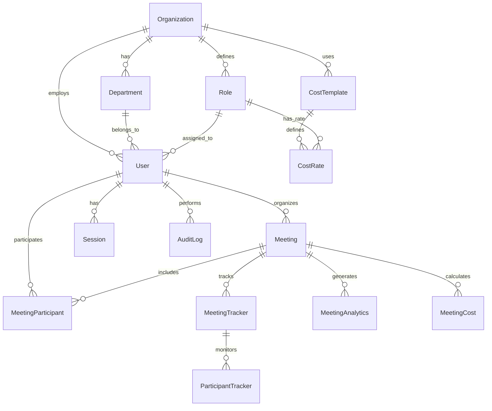

# Meeting Time Cost Manager - データベース設計

## 🗄️ データベース設計概要

### 設計原則
- **正規化**: 第3正規形までの適用
- **スケーラビリティ**: 大企業対応（10万ユーザー）
- **パフォーマンス**: インデックス最適化
- **セキュリティ**: 行レベルセキュリティ（RLS）
- **監査**: 全操作の追跡可能性

### 技術選定
- **PostgreSQL 15**: メインデータベース
- **TimescaleDB**: 時系列データ（会議トラッキング）
- **Redis**: セッション・キャッシュ
- **Prisma ORM**: 型安全なデータアクセス

## 📊 エンティティ関係図



## 🏢 組織・ユーザー管理

### Organization（組織）
```sql
CREATE TABLE organizations (
    id UUID PRIMARY KEY DEFAULT gen_random_uuid(),
    name VARCHAR(255) NOT NULL,
    slug VARCHAR(100) UNIQUE NOT NULL,
    domain VARCHAR(255),
    industry VARCHAR(100),
    employee_count INTEGER,
    timezone VARCHAR(50) DEFAULT 'Asia/Tokyo',
    currency VARCHAR(3) DEFAULT 'JPY',
    fiscal_year_start DATE,
    settings JSONB DEFAULT '{}',
    subscription_plan VARCHAR(50) DEFAULT 'basic',
    subscription_expires_at TIMESTAMP WITH TIME ZONE,
    created_at TIMESTAMP WITH TIME ZONE DEFAULT NOW(),
    updated_at TIMESTAMP WITH TIME ZONE DEFAULT NOW(),
    deleted_at TIMESTAMP WITH TIME ZONE
);
```

### Department（部署）
```sql
CREATE TABLE departments (
    id UUID PRIMARY KEY DEFAULT gen_random_uuid(),
    organization_id UUID NOT NULL REFERENCES organizations(id),
    parent_id UUID REFERENCES departments(id),
    name VARCHAR(255) NOT NULL,
    code VARCHAR(50),
    description TEXT,
    cost_center VARCHAR(100),
    budget_annual DECIMAL(15,2),
    manager_id UUID REFERENCES users(id),
    created_at TIMESTAMP WITH TIME ZONE DEFAULT NOW(),
    updated_at TIMESTAMP WITH TIME ZONE DEFAULT NOW(),
    deleted_at TIMESTAMP WITH TIME ZONE,
    
    UNIQUE(organization_id, code)
);
```

### Role（役職）
```sql
CREATE TABLE roles (
    id UUID PRIMARY KEY DEFAULT gen_random_uuid(),
    organization_id UUID NOT NULL REFERENCES organizations(id),
    name VARCHAR(255) NOT NULL,
    level INTEGER NOT NULL, -- 1:CEO, 2:役員, 3:部長, 4:課長, 5:主任, 6:一般
    grade VARCHAR(10), -- S1, M1, J1 etc.
    description TEXT,
    permissions JSONB DEFAULT '{}',
    default_hourly_rate DECIMAL(10,2),
    created_at TIMESTAMP WITH TIME ZONE DEFAULT NOW(),
    updated_at TIMESTAMP WITH TIME ZONE DEFAULT NOW(),
    
    UNIQUE(organization_id, name)
);
```

### User（ユーザー）
```sql
CREATE TABLE users (
    id UUID PRIMARY KEY DEFAULT gen_random_uuid(),
    organization_id UUID NOT NULL REFERENCES organizations(id),
    department_id UUID REFERENCES departments(id),
    role_id UUID REFERENCES roles(id),
    employee_id VARCHAR(50),
    email VARCHAR(255) UNIQUE NOT NULL,
    password_hash VARCHAR(255),
    first_name VARCHAR(100) NOT NULL,
    last_name VARCHAR(100) NOT NULL,
    display_name VARCHAR(200),
    avatar_url TEXT,
    phone VARCHAR(20),
    timezone VARCHAR(50) DEFAULT 'Asia/Tokyo',
    locale VARCHAR(10) DEFAULT 'ja',
    hourly_rate DECIMAL(10,2),
    monthly_salary DECIMAL(12,2),
    employment_type VARCHAR(50) DEFAULT 'full_time', -- full_time, part_time, contractor
    hired_at DATE,
    status VARCHAR(20) DEFAULT 'active', -- active, inactive, suspended
    last_login_at TIMESTAMP WITH TIME ZONE,
    email_verified_at TIMESTAMP WITH TIME ZONE,
    created_at TIMESTAMP WITH TIME ZONE DEFAULT NOW(),
    updated_at TIMESTAMP WITH TIME ZONE DEFAULT NOW(),
    deleted_at TIMESTAMP WITH TIME ZONE,
    
    UNIQUE(organization_id, employee_id)
);
```

## 💰 コスト管理

### CostTemplate（コストテンプレート）
```sql
CREATE TABLE cost_templates (
    id UUID PRIMARY KEY DEFAULT gen_random_uuid(),
    organization_id UUID NOT NULL REFERENCES organizations(id),
    name VARCHAR(255) NOT NULL,
    description TEXT,
    currency VARCHAR(3) DEFAULT 'JPY',
    overtime_multiplier DECIMAL(3,2) DEFAULT 1.25,
    holiday_multiplier DECIMAL(3,2) DEFAULT 1.5,
    night_shift_multiplier DECIMAL(3,2) DEFAULT 1.2,
    is_default BOOLEAN DEFAULT FALSE,
    created_at TIMESTAMP WITH TIME ZONE DEFAULT NOW(),
    updated_at TIMESTAMP WITH TIME ZONE DEFAULT NOW()
);
```

### CostRate（時給レート）
```sql
CREATE TABLE cost_rates (
    id UUID PRIMARY KEY DEFAULT gen_random_uuid(),
    cost_template_id UUID NOT NULL REFERENCES cost_templates(id),
    role_id UUID REFERENCES roles(id),
    user_id UUID REFERENCES users(id),
    base_hourly_rate DECIMAL(10,2) NOT NULL,
    effective_from DATE NOT NULL,
    effective_to DATE,
    rate_type VARCHAR(20) DEFAULT 'standard', -- standard, overtime, holiday
    created_at TIMESTAMP WITH TIME ZONE DEFAULT NOW(),
    
    CONSTRAINT check_user_or_role CHECK (
        (role_id IS NOT NULL AND user_id IS NULL) OR 
        (role_id IS NULL AND user_id IS NOT NULL)
    )
);
```

## 🤝 会議管理

### Meeting（会議）
```sql
CREATE TABLE meetings (
    id UUID PRIMARY KEY DEFAULT gen_random_uuid(),
    organization_id UUID NOT NULL REFERENCES organizations(id),
    organizer_id UUID NOT NULL REFERENCES users(id),
    title VARCHAR(500) NOT NULL,
    description TEXT,
    meeting_type VARCHAR(50) DEFAULT 'regular', -- regular, emergency, board, review
    category VARCHAR(100),
    location VARCHAR(255),
    room_id UUID REFERENCES meeting_rooms(id),
    is_online BOOLEAN DEFAULT FALSE,
    meeting_url TEXT,
    scheduled_start_at TIMESTAMP WITH TIME ZONE NOT NULL,
    scheduled_end_at TIMESTAMP WITH TIME ZONE NOT NULL,
    actual_start_at TIMESTAMP WITH TIME ZONE,
    actual_end_at TIMESTAMP WITH TIME ZONE,
    status VARCHAR(20) DEFAULT 'scheduled', -- scheduled, in_progress, completed, cancelled
    agenda TEXT,
    objectives JSONB,
    expected_outcomes TEXT,
    expected_revenue DECIMAL(15,2),
    priority VARCHAR(20) DEFAULT 'medium', -- low, medium, high, critical
    tags TEXT[],
    settings JSONB DEFAULT '{}',
    created_at TIMESTAMP WITH TIME ZONE DEFAULT NOW(),
    updated_at TIMESTAMP WITH TIME ZONE DEFAULT NOW(),
    deleted_at TIMESTAMP WITH TIME ZONE
);
```

### MeetingParticipant（会議参加者）
```sql
CREATE TABLE meeting_participants (
    id UUID PRIMARY KEY DEFAULT gen_random_uuid(),
    meeting_id UUID NOT NULL REFERENCES meetings(id),
    user_id UUID NOT NULL REFERENCES users(id),
    role VARCHAR(50) DEFAULT 'participant', -- organizer, presenter, participant, observer
    invitation_status VARCHAR(20) DEFAULT 'pending', -- pending, accepted, declined, tentative
    attendance_status VARCHAR(20) DEFAULT 'unknown', -- present, absent, late, left_early
    joined_at TIMESTAMP WITH TIME ZONE,
    left_at TIMESTAMP WITH TIME ZONE,
    hourly_rate_override DECIMAL(10,2),
    is_required BOOLEAN DEFAULT TRUE,
    notes TEXT,
    created_at TIMESTAMP WITH TIME ZONE DEFAULT NOW(),
    updated_at TIMESTAMP WITH TIME ZONE DEFAULT NOW(),
    
    UNIQUE(meeting_id, user_id)
);
```

### MeetingCost（会議コスト）
```sql
CREATE TABLE meeting_costs (
    id UUID PRIMARY KEY DEFAULT gen_random_uuid(),
    meeting_id UUID NOT NULL REFERENCES meetings(id) UNIQUE,
    total_cost DECIMAL(15,2) NOT NULL DEFAULT 0,
    direct_cost DECIMAL(15,2) NOT NULL DEFAULT 0,
    indirect_cost DECIMAL(15,2) NOT NULL DEFAULT 0,
    opportunity_cost DECIMAL(15,2) NOT NULL DEFAULT 0,
    participant_count INTEGER NOT NULL DEFAULT 0,
    actual_duration_minutes INTEGER,
    scheduled_duration_minutes INTEGER,
    average_hourly_rate DECIMAL(10,2),
    cost_per_minute DECIMAL(10,2),
    efficiency_score DECIMAL(3,2), -- 0.00 - 1.00
    roi_percentage DECIMAL(5,2),
    cost_breakdown JSONB,
    calculated_at TIMESTAMP WITH TIME ZONE DEFAULT NOW(),
    updated_at TIMESTAMP WITH TIME ZONE DEFAULT NOW()
);
```

## 📊 リアルタイムトラッキング

### MeetingTracker（会議トラッキング）
```sql
CREATE TABLE meeting_trackers (
    id UUID PRIMARY KEY DEFAULT gen_random_uuid(),
    meeting_id UUID NOT NULL REFERENCES meetings(id),
    tracker_session_id UUID NOT NULL UNIQUE,
    started_by UUID NOT NULL REFERENCES users(id),
    started_at TIMESTAMP WITH TIME ZONE NOT NULL,
    ended_at TIMESTAMP WITH TIME ZONE,
    current_cost DECIMAL(15,2) DEFAULT 0,
    current_participants INTEGER DEFAULT 0,
    status VARCHAR(20) DEFAULT 'active', -- active, paused, ended
    real_time_data JSONB DEFAULT '{}',
    created_at TIMESTAMP WITH TIME ZONE DEFAULT NOW(),
    updated_at TIMESTAMP WITH TIME ZONE DEFAULT NOW()
);
```

### ParticipantTracker（参加者トラッキング）
```sql
CREATE TABLE participant_trackers (
    id UUID PRIMARY KEY DEFAULT gen_random_uuid(),
    meeting_tracker_id UUID NOT NULL REFERENCES meeting_trackers(id),
    participant_id UUID NOT NULL REFERENCES meeting_participants(id),
    joined_at TIMESTAMP WITH TIME ZONE NOT NULL,
    left_at TIMESTAMP WITH TIME ZONE,
    total_duration_minutes INTEGER DEFAULT 0,
    is_active BOOLEAN DEFAULT TRUE,
    activity_data JSONB DEFAULT '{}',
    created_at TIMESTAMP WITH TIME ZONE DEFAULT NOW(),
    updated_at TIMESTAMP WITH TIME ZONE DEFAULT NOW(),
    
    UNIQUE(meeting_tracker_id, participant_id)
);
```

## 📈 分析・レポート

### MeetingAnalytics（会議分析）
```sql
CREATE TABLE meeting_analytics (
    id UUID PRIMARY KEY DEFAULT gen_random_uuid(),
    meeting_id UUID NOT NULL REFERENCES meetings(id) UNIQUE,
    organization_id UUID NOT NULL REFERENCES organizations(id),
    department_id UUID REFERENCES departments(id),
    meeting_date DATE NOT NULL,
    meeting_hour INTEGER NOT NULL, -- 0-23
    day_of_week INTEGER NOT NULL, -- 1-7 (Monday-Sunday)
    month INTEGER NOT NULL, -- 1-12
    quarter INTEGER NOT NULL, -- 1-4
    year INTEGER NOT NULL,
    
    -- Cost Metrics
    total_cost DECIMAL(15,2),
    cost_per_participant DECIMAL(10,2),
    cost_per_minute DECIMAL(8,2),
    
    -- Time Metrics
    scheduled_duration INTEGER,
    actual_duration INTEGER,
    preparation_time INTEGER,
    follow_up_time INTEGER,
    
    -- Efficiency Metrics
    start_delay_minutes INTEGER DEFAULT 0,
    efficiency_score DECIMAL(3,2),
    productivity_score DECIMAL(3,2),
    decision_count INTEGER DEFAULT 0,
    
    -- Participation Metrics
    invited_count INTEGER,
    attended_count INTEGER,
    attendance_rate DECIMAL(3,2),
    late_arrivals INTEGER DEFAULT 0,
    early_departures INTEGER DEFAULT 0,
    
    -- Financial Metrics
    expected_revenue DECIMAL(15,2),
    roi_percentage DECIMAL(5,2),
    cost_benefit_ratio DECIMAL(5,2),
    
    -- Quality Metrics
    satisfaction_score DECIMAL(3,2),
    outcome_achievement_rate DECIMAL(3,2),
    
    processed_at TIMESTAMP WITH TIME ZONE DEFAULT NOW(),
    updated_at TIMESTAMP WITH TIME ZONE DEFAULT NOW()
);
```

### OrganizationMetrics（組織メトリクス）
```sql
CREATE TABLE organization_metrics (
    id UUID PRIMARY KEY DEFAULT gen_random_uuid(),
    organization_id UUID NOT NULL REFERENCES organizations(id),
    metric_date DATE NOT NULL,
    metric_type VARCHAR(50) NOT NULL, -- daily, weekly, monthly, quarterly, yearly
    
    -- Meeting Volume
    total_meetings INTEGER DEFAULT 0,
    total_meeting_hours DECIMAL(8,2) DEFAULT 0,
    average_meeting_duration DECIMAL(5,2),
    
    -- Cost Analysis
    total_meeting_cost DECIMAL(15,2) DEFAULT 0,
    average_meeting_cost DECIMAL(10,2),
    cost_per_employee DECIMAL(10,2),
    cost_trend_percentage DECIMAL(5,2),
    
    -- Efficiency Metrics
    overall_efficiency_score DECIMAL(3,2),
    on_time_start_rate DECIMAL(3,2),
    meeting_utilization_rate DECIMAL(3,2),
    
    -- ROI Analysis
    total_expected_revenue DECIMAL(15,2),
    average_roi DECIMAL(5,2),
    profitable_meetings_percentage DECIMAL(3,2),
    
    -- Benchmarks
    industry_comparison JSONB,
    size_comparison JSONB,
    
    calculated_at TIMESTAMP WITH TIME ZONE DEFAULT NOW(),
    
    UNIQUE(organization_id, metric_date, metric_type)
);
```

## 🔒 セキュリティ・監査

### Session（セッション管理）
```sql
CREATE TABLE sessions (
    id UUID PRIMARY KEY DEFAULT gen_random_uuid(),
    user_id UUID NOT NULL REFERENCES users(id),
    session_token VARCHAR(255) UNIQUE NOT NULL,
    refresh_token VARCHAR(255) UNIQUE,
    device_info JSONB,
    ip_address INET,
    user_agent TEXT,
    expires_at TIMESTAMP WITH TIME ZONE NOT NULL,
    last_accessed_at TIMESTAMP WITH TIME ZONE DEFAULT NOW(),
    created_at TIMESTAMP WITH TIME ZONE DEFAULT NOW(),
    revoked_at TIMESTAMP WITH TIME ZONE
);
```

### AuditLog（監査ログ）
```sql
CREATE TABLE audit_logs (
    id UUID PRIMARY KEY DEFAULT gen_random_uuid(),
    organization_id UUID NOT NULL REFERENCES organizations(id),
    user_id UUID REFERENCES users(id),
    action VARCHAR(100) NOT NULL,
    resource_type VARCHAR(50) NOT NULL,
    resource_id UUID,
    old_values JSONB,
    new_values JSONB,
    metadata JSONB,
    ip_address INET,
    user_agent TEXT,
    created_at TIMESTAMP WITH TIME ZONE DEFAULT NOW()
);
```

## 📋 マスターデータ

### MeetingRooms（会議室）
```sql
CREATE TABLE meeting_rooms (
    id UUID PRIMARY KEY DEFAULT gen_random_uuid(),
    organization_id UUID NOT NULL REFERENCES organizations(id),
    name VARCHAR(255) NOT NULL,
    location VARCHAR(255),
    capacity INTEGER,
    hourly_cost DECIMAL(8,2),
    equipment JSONB,
    is_bookable BOOLEAN DEFAULT TRUE,
    created_at TIMESTAMP WITH TIME ZONE DEFAULT NOW(),
    updated_at TIMESTAMP WITH TIME ZONE DEFAULT NOW()
);
```

### Notifications（通知）
```sql
CREATE TABLE notifications (
    id UUID PRIMARY KEY DEFAULT gen_random_uuid(),
    user_id UUID NOT NULL REFERENCES users(id),
    type VARCHAR(50) NOT NULL,
    title VARCHAR(255) NOT NULL,
    message TEXT,
    data JSONB,
    read_at TIMESTAMP WITH TIME ZONE,
    created_at TIMESTAMP WITH TIME ZONE DEFAULT NOW()
);
```

## 🔍 インデックス設計

```sql
-- パフォーマンス最適化のためのインデックス

-- Users
CREATE INDEX idx_users_organization_email ON users(organization_id, email);
CREATE INDEX idx_users_department_role ON users(department_id, role_id);
CREATE INDEX idx_users_status_active ON users(status) WHERE status = 'active';

-- Meetings
CREATE INDEX idx_meetings_organization_date ON meetings(organization_id, scheduled_start_at);
CREATE INDEX idx_meetings_organizer_date ON meetings(organizer_id, scheduled_start_at);
CREATE INDEX idx_meetings_status ON meetings(status);
CREATE INDEX idx_meetings_type_category ON meetings(meeting_type, category);

-- Meeting Participants
CREATE INDEX idx_meeting_participants_user ON meeting_participants(user_id, meeting_id);
CREATE INDEX idx_meeting_participants_meeting ON meeting_participants(meeting_id, attendance_status);

-- Analytics
CREATE INDEX idx_meeting_analytics_org_date ON meeting_analytics(organization_id, meeting_date);
CREATE INDEX idx_meeting_analytics_department_date ON meeting_analytics(department_id, meeting_date);
CREATE INDEX idx_meeting_analytics_date_metrics ON meeting_analytics(meeting_date, total_cost, efficiency_score);

-- Audit Logs
CREATE INDEX idx_audit_logs_org_action ON audit_logs(organization_id, action, created_at);
CREATE INDEX idx_audit_logs_user_time ON audit_logs(user_id, created_at);
CREATE INDEX idx_audit_logs_resource ON audit_logs(resource_type, resource_id);

-- Time-series data (using TimescaleDB)
SELECT create_hypertable('meeting_analytics', 'meeting_date');
SELECT create_hypertable('organization_metrics', 'metric_date');
```

## 🛡️ セキュリティ設定

### Row Level Security (RLS)
```sql
-- 組織レベルでのデータ分離
ALTER TABLE users ENABLE ROW LEVEL SECURITY;
ALTER TABLE meetings ENABLE ROW LEVEL SECURITY;
ALTER TABLE meeting_participants ENABLE ROW LEVEL SECURITY;

-- ユーザーは自分の組織のデータのみアクセス可能
CREATE POLICY user_organization_policy ON users
    FOR ALL TO authenticated_user
    USING (organization_id = current_setting('app.current_organization_id')::UUID);

CREATE POLICY meeting_organization_policy ON meetings
    FOR ALL TO authenticated_user
    USING (organization_id = current_setting('app.current_organization_id')::UUID);
```

この設計により、**エンタープライズグレードの会議コスト管理システム**の基盤が完成します。